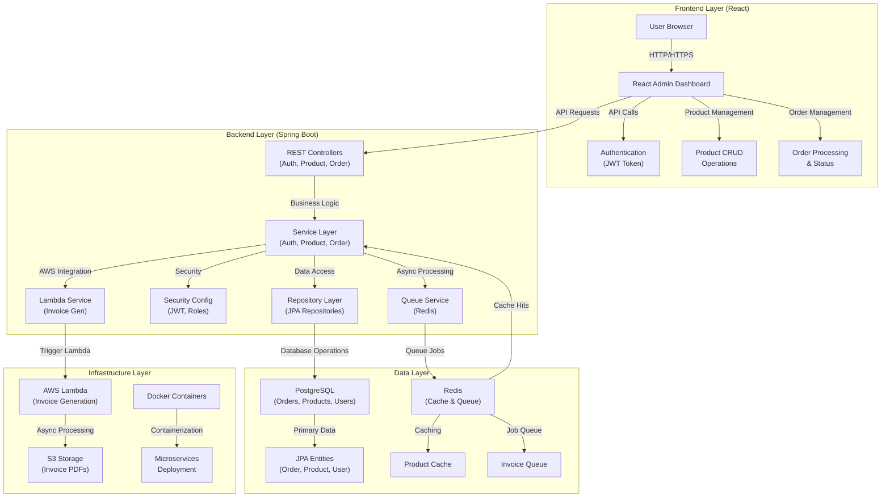
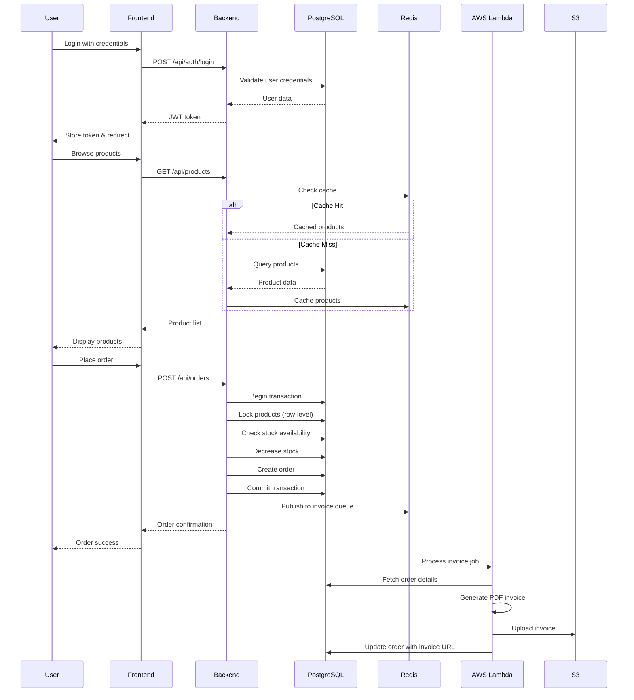

# OrderStream

An e-commerce order management system built with Spring Boot and React. Features atomic order placement, real-time inventory management, role-based access control, and asynchronous invoice generation with AWS Lambda integration.

---

## Architecture

---

## System Overview

OrderStream implements a layered architecture with clear separation of concerns across four main layers:

### **Frontend Layer**

- **React Admin Dashboard**: Modern UI for order and product management
- **Authentication**: JWT-based login with role-based access control
- **Real-time Updates**: Live order status and inventory tracking
- **Responsive Design**: Mobile-friendly interface with Tailwind CSS

### **Backend Layer**

- **REST Controllers**: Handle HTTP requests for authentication, products, and orders
- **Service Layer**: Business logic for order processing, inventory management, and user authentication
- **Security**: JWT authentication with role-based authorization (USER/ADMIN)
- **Async Processing**: Redis-based job queue for invoice generation

### **Data Layer**

- **PostgreSQL**: Primary database for orders, products, and users with row-level locking
- **Redis**: Caching layer for product data and job queue for async operations
- **JPA Entities**: Domain models with proper relationships and constraints

### **Infrastructure Layer**

- **AWS Lambda**: Serverless invoice generation triggered by order completion
- **Docker**: Containerized deployment with Docker Compose
- **S3**: Cloud storage for generated invoice PDFs

The system supports three user roles:

1. **Anonymous Users**: Can browse products and register/login
2. **Authenticated Users**: Can place orders and view their order history
3. **Admin Users**: Can manage products, view all orders, and access admin dashboard

---

## Data Flow

---

## Features

- **Atomic Order Processing**: Database transactions with row-level locking prevent race conditions
- **Real-time Inventory**: Stock updates with optimistic locking for high concurrency
- **Role-based Access**: JWT authentication with USER/ADMIN roles
- **Product Management**: CRUD operations with stock tracking and low-stock alerts
- **Order Management**: Complete order lifecycle with status tracking
- **Async Invoice Generation**: AWS Lambda integration for PDF generation
- **Caching**: Redis-based product caching for improved performance
- **Admin Dashboard**: React-based interface for order and product management
- **Docker Support**: Complete containerized deployment with health checks
- **Monitoring**: Comprehensive health checks and metrics

---

## Tech Stack

- **Frontend**: React, TypeScript, Tailwind CSS, Axios
- **Backend**: Spring Boot 3.5.3, Java 17, Spring Security, JWT
- **Database**: PostgreSQL 15 with row-level locking
- **Cache/Queue**: Redis 7 for caching and job queues
- **Cloud**: AWS Lambda, S3, SNS
- **Container**: Docker, Docker Compose
- **Build**: Maven, npm
- **Testing**: JUnit 5, Testcontainers
