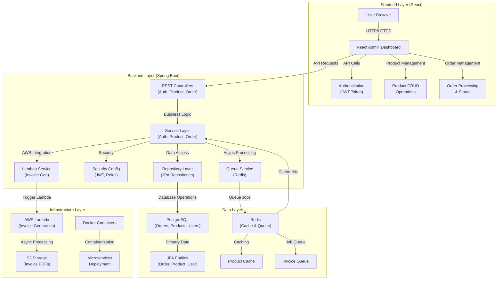
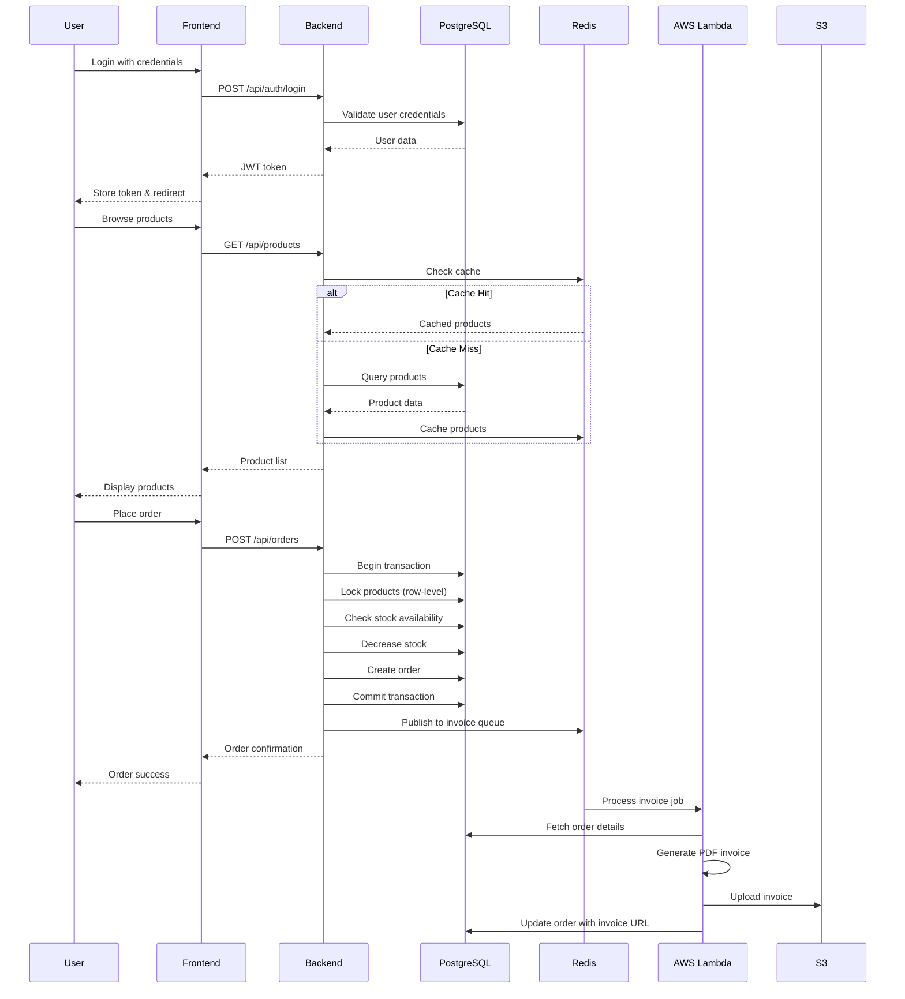

# OrderStream

A comprehensive e-commerce order management system built with Spring Boot and React. Features atomic order placement, real-time inventory management, role-based access control, and asynchronous invoice generation with AWS Lambda integration.

---

## Architecture



---

## System Overview

OrderStream implements a layered architecture with clear separation of concerns across four main layers:

### **Frontend Layer**

- **React Admin Dashboard**: Modern UI for order and product management
- **Authentication**: JWT-based login with role-based access control
- **Real-time Updates**: Live order status and inventory tracking
- **Responsive Design**: Mobile-friendly interface with Tailwind CSS

### **Backend Layer**

- **REST Controllers**: Handle HTTP requests for authentication, products, and orders
- **Service Layer**: Business logic for order processing, inventory management, and user authentication
- **Security**: JWT authentication with role-based authorization (USER/ADMIN)
- **Async Processing**: Redis-based job queue for invoice generation

### **Data Layer**

- **PostgreSQL**: Primary database for orders, products, and users with row-level locking
- **Redis**: Caching layer for product data and job queue for async operations
- **JPA Entities**: Domain models with proper relationships and constraints

### **Infrastructure Layer**

- **AWS Lambda**: Serverless invoice generation triggered by order completion
- **Docker**: Containerized deployment with Docker Compose
- **S3**: Cloud storage for generated invoice PDFs

The system supports three user roles:

1. **Anonymous Users**: Can browse products and register/login
2. **Authenticated Users**: Can place orders and view their order history
3. **Admin Users**: Can manage products, view all orders, and access admin dashboard

---

## Data Flow



---

## Features

- **Atomic Order Processing**: Database transactions with row-level locking prevent race conditions
- **Real-time Inventory**: Stock updates with optimistic locking for high concurrency
- **Role-based Access**: JWT authentication with USER/ADMIN roles
- **Product Management**: CRUD operations with stock tracking and low-stock alerts
- **Order Management**: Complete order lifecycle with status tracking
- **Async Invoice Generation**: AWS Lambda integration for PDF generation
- **Caching**: Redis-based product caching for improved performance
- **Admin Dashboard**: React-based interface for order and product management
- **Docker Support**: Complete containerized deployment with health checks
- **Monitoring**: Comprehensive health checks and metrics

---

## Tech Stack

- **Frontend**: React, TypeScript, Tailwind CSS, Axios
- **Backend**: Spring Boot 3.5.3, Java 17, Spring Security, JWT
- **Database**: PostgreSQL 15 with row-level locking
- **Cache/Queue**: Redis 7 for caching and job queues
- **Cloud**: AWS Lambda, S3, SNS
- **Container**: Docker, Docker Compose
- **Build**: Maven, npm
- **Testing**: JUnit 5, Testcontainers

---

## Quick Start

### Prerequisites

- Docker and Docker Compose
- Java 17+
- Maven 3.6+

### 1. Clone and Setup

```bash
git clone <repository-url>
cd orderstream
```

### 2. Start the System

```bash
docker-compose up -d
```

This will start:

- PostgreSQL database on port 5432
- Redis cache/queue on port 6379
- Spring Boot backend on port 8080
- React frontend on port 3000

### 3. Verify Installation

```bash
# Check if services are running
docker-compose ps

# Test the API
curl http://localhost:8080/api/health
```

### 4. Access the Application

- **Frontend**: http://localhost:3000
- **Backend API**: http://localhost:8080/api
- **Health Check**: http://localhost:8080/api/health

---

## API Endpoints

### Authentication

- `POST /api/auth/register` - Register new user
- `POST /api/auth/login` - User login

### Products

- `GET /api/products` - Get all products
- `GET /api/products/{id}` - Get product by ID
- `POST /api/products` - Create product (ADMIN only)
- `PUT /api/products/{id}` - Update product (ADMIN only)
- `DELETE /api/products/{id}` - Delete product (ADMIN only)
- `GET /api/products/low-stock` - Get low stock products (ADMIN only)

### Orders

- `POST /api/orders` - Create new order
- `GET /api/orders/my` - Get user's orders
- `GET /api/orders` - Get all orders (ADMIN only)
- `GET /api/orders/{id}` - Get order by ID
- `PUT /api/orders/{id}/status` - Update order status (ADMIN only)

---

## Configuration

### Environment Variables

```yaml
# Database
SPRING_DATASOURCE_URL: jdbc:postgresql://localhost:5432/orderstream
SPRING_DATASOURCE_USERNAME: postgres
SPRING_DATASOURCE_PASSWORD: postgres

# Redis
SPRING_DATA_REDIS_HOST: localhost
SPRING_DATA_REDIS_PORT: 6379

# JWT
JWT_SECRET: your-secret-key
JWT_EXPIRATION: 86400000

# AWS
AWS_REGION: us-east-1
AWS_ACCESS_KEY_ID: your-access-key
AWS_SECRET_ACCESS_KEY: your-secret-key
```

---

## Development

### Local Development

```bash
# Start dependencies
docker-compose up postgres redis -d

# Run backend
cd backend
mvn spring-boot:run

# Run frontend
cd frontend
npm install
npm start
```

### Testing

```bash
# Run backend tests
cd backend
mvn test

# Run integration tests
mvn test -Dspring.profiles.active=test
```

---

## Deployment

### Docker Deployment

```bash
# Development
docker-compose up -d

# Production
docker-compose -f docker-compose.prod.yml up -d
```

### AWS Deployment

- **ECS/Fargate**: Container orchestration
- **RDS**: Managed PostgreSQL
- **ElastiCache**: Managed Redis
- **Lambda**: Serverless invoice generation
- **S3**: Invoice storage

---

## Monitoring

### Health Checks

- Application: `GET /api/health`
- Database: `GET /actuator/health`
- Redis: `GET /actuator/health`

### Metrics

- Application metrics: `GET /actuator/metrics`
- Custom business metrics available

---

## Security

### Authentication

- JWT-based stateless authentication
- Password encryption with BCrypt
- Token expiration and refresh

### Authorization

- Role-based access control (USER/ADMIN)
- Method-level security annotations
- Resource-level access control

### Data Protection

- Input validation and sanitization
- SQL injection prevention
- XSS protection

---

## Performance

### Caching

- Redis-based product caching
- Cache eviction strategies
- Distributed caching support

### Concurrency

- PostgreSQL row-level locking
- Optimistic locking for high concurrency
- Deadlock prevention strategies

### Async Processing

- Redis-based job queues
- AWS Lambda integration
- Non-blocking operations

---

## Contributing

1. Fork the repository
2. Create a feature branch
3. Make your changes
4. Add tests
5. Submit a pull request

---

## License

This project is licensed under the MIT License - see the LICENSE file for details.
